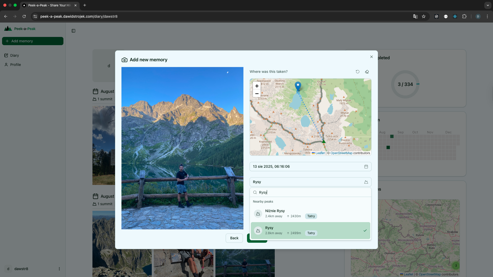
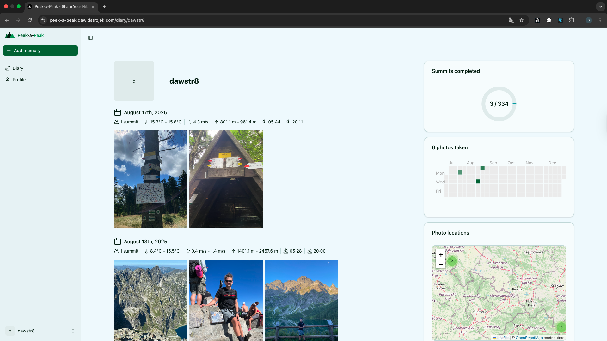

# 🏔️ Peek-a-Peak

> **A full-stack summit diary that transforms hiking photos into intelligent, geo-enriched memories**

Transform your hiking photos into a beautiful, intelligent diary with automatic peak detection, weather history, and interactive maps. Built to showcase modern full-stack development with **React**, **FastAPI**, **PostGIS**, and **async Python**.

<details>
<summary>🌐 <strong><a href="https://peek-a-peak.dawidstrojek.com">Live Demo</a></strong> • 📱 Try uploading a photo with GPS data!</summary>



</details>

<details>
<summary>📖 <strong><a href="https://peek-a-peak.dawidstrojek.com/diary/dawstr8">Example Diary</a></strong> • See what a complete summit diary looks like!</summary>



</details>

---

## ✨ What It Does

**Smart Upload & Enrichment**  
Drag & drop a summit photo → EXIF metadata extracted in-browser → Polish peak auto-suggested → historical weather fetched asynchronously → stored in PostGIS with S3/MinIO.

**Geospatial Intelligence**  
PostGIS spatial queries match coordinates to Polish peaks (scraped from Wikipedia), calculate distances, and power interactive Leaflet maps with real-time peak suggestions.

**Personal Timeline**  
Browse your summit diary with infinite scrolling, weather overlays, and session-based authentication-all server-rendered with Next.js App Router.

---

## 🧱 Tech Stack

| Category           | Technologies                                                                                                                          |
| :----------------- | :------------------------------------------------------------------------------------------------------------------------------------ |
| **Frontend**       | **Next.js 15** (App Router), **TypeScript**, **TanStack Query**, **Tailwind CSS v4**, **shadcn/ui**, **Leaflet**, **React Hook Form** |
| **Backend**        | **FastAPI**, **SQLModel** (Async), **PostgreSQL** + **PostGIS**, **Alembic**, **Pydantic**, **HTTPX**                                 |
| **Infrastructure** | **Docker Compose**, **MinIO** (S3-compatible), **VS Code Dev Containers**, **Nginx**                                                  |
| **Tools**          | **Pytest**, **ESLint**, **Prettier**, **GitHub Actions**                                                                              |

---

## ✨ Engineering Highlights

### 🏗️ Domain-Driven Architecture

- **Modular Design**: Backend organized by domain (`auth`, `peaks`, `weather`) rather than technical layers for scalability.
- **Type Safety**: End-to-end type safety from database models (SQLModel) to API contracts (Pydantic) and frontend clients (TypeScript).

### 🌍 Advanced Geospatial Features

- **PostGIS Integration**: Utilizes `Geography(Point, 4326)` for accurate location storage and `ST_Distance` for efficient radius searches.
- **Smart Peak Matching**: Spatial queries automatically suggest the nearest peak based on photo EXIF data.

### ⚡ Performance & Async Processing

- **Non-blocking Operations**: Heavy tasks like historical weather fetching run in background threads (`BackgroundTasks`) to ensure instant UI feedback.
- **Optimistic UI**: Frontend updates immediately using TanStack Query's optimistic updates while the server processes data.

### 🕷️ Robust Data Scraping

- **Wikipedia Integration**: Custom scraping pipeline to extract Polish peak data (coordinates, mountain ranges, elevations) directly from Wikipedia.
- **Resilient Architecture**: Implements respectful rate limiting, retries with exponential backoff, and comprehensive error handling.
- **Data Normalization**: Cleans and standardizes unstructured HTML data into structured PostGIS-ready records.

### 🛡️ Production-Ready Practices

- **Reproducible Environments**: Fully containerized setup with Docker and VS Code Dev Containers.
- **Secure Authentication**: Session-based auth with HttpOnly cookies and server-side session storage.
- **Pluggable Storage**: Abstracted file storage interface supporting both local filesystem (dev) and S3/MinIO (prod).

---

## 🏗️ Architecture

```
┌─────────────────────────────────────────────────────────────-┐
│  Next.js 15 Frontend (TypeScript, TanStack Query, shadcn)    │
│  • EXIF extraction  • Peak search  • Map UI  • Infinite      │
│    scroll diary     • Route-based auth                       │
└────────────────────┬──────────────────────-┬─────────────────┘
                     │ REST API              │ Public downloads
                     │ (session cookies)     │ (direct access)
┌────────────────────▼────────────────────-┐ │
│  FastAPI Backend (Python, async SQLModel)│ │
│  • Auth/Sessions  • Photos + EXIF        │ │
│  • Peak matching  • Weather enrichment   │ │
│  • S3/MinIO uploads                      │ │
└────────────────────┬────────────────────-┘ │
                     │                       │
        ┌────────────┴────────────┐          │
        ▼                         ▼          ▼
┌───────────────────┐    ┌────────────────────┐
│  PostgreSQL 15    │    │  MinIO (S3-like)   │
│  + PostGIS        │    │  Object Storage    │
│  (geospatial)     │    │                    │
└───────────────────┘    └────────────────────┘
```

**Data Flow**: Browser extracts EXIF → Next.js validates & uploads → FastAPI persists to PostGIS → Background task fetches weather → MinIO stores original file → Diary queries use spatial indexes.

---

## 🚀 Quick Start

> **Tip:** The recommended way to run this project is using the VS Code Dev Container. See the [Dev Container README](./.devcontainer/README.md) for details.

### Option 1: Docker Compose

```bash
git clone https://github.com/dawstr8/peek-a-peak.git
cd peek-a-peak
docker compose -f docker-compose.dev.yaml up --build
```

### Option 2: Manual Setup

For detailed manual setup instructions, please refer to:

- **[Backend README](./backend/README.md)**
- **[Frontend README](./frontend/README.md)**

---

## 📚 Documentation

For deep dives into testing, specific commands, and architectural decisions, please refer to the dedicated READMEs:

- **[Backend Documentation](./backend/README.md)**: Detailed guide on API setup, database management, async workers, and testing.
- **[Frontend Documentation](./frontend/README.md)**: Comprehensive overview of the Next.js app, component architecture, and client-side logic.

---

## 📂 Project Structure

```
peek-a-peak/
├── frontend/          # Next.js 15 App Router (React 19, TypeScript, TanStack Query)
├── backend/           # FastAPI (Python, SQLModel, PostGIS, async repos)
├── .devcontainer/     # VS Code Dev Container config (Docker-based)
├── postgres/          # PostgreSQL + PostGIS Docker setup
├── minio/             # MinIO (S3-compatible) storage config
└── scripts/           # Deployment & backup scripts
```

---

## 🎓 What This Project Demonstrates

**For Backend Engineers:**

- **Async Python**: Leveraging `async`/`await` for I/O-bound operations and `BackgroundTasks` for non-blocking workflows.
- **Geospatial Data**: Practical use of PostGIS for location-based features and spatial indexing.
- **Data Engineering**: Robust scraping pipeline for Wikipedia data with proper error handling and rate limiting.
- **System Design**: Separation of concerns with Repository pattern and Dependency Injection.

**For Frontend Engineers:**

- **Modern React**: Next.js 15 App Router, Server Components, and React 19 features.
- **Complex State**: Managing async server state with TanStack Query and client-side form state with React Hook Form.
- **UX Focus**: Optimistic updates, infinite scrolling, and client-side image processing (EXIF).

**For Full-Stack Engineers:**

- **End-to-End Type Safety**: Shared understanding of data structures between Python and TypeScript.
- **DevOps Culture**: Docker-based development workflow and production-ready containerization.
- **Storage Abstraction**: Handling file uploads and storage across different environments (Local vs S3).

---

## 👤 Author

**Dawid Strojek**  
Full-Stack Engineer | React • FastAPI • TypeScript • Python  
Previously: Vue.js, NestJS, PHP

📧 [dawid.strojek@gmail.com](mailto:dawid.strojek@gmail.com)  
💼 [LinkedIn](https://www.linkedin.com/in/dawid-strojek/)  
🐙 [GitHub](https://github.com/dawstr8)  
🌐 [Portfolio](https://peek-a-peak.dawidstrojek.com)

---

## 📄 License

This is a personal portfolio project. Feel free to explore, but please don't copy for your own portfolio. Reach out if you'd like to discuss the architecture or collaborate!
